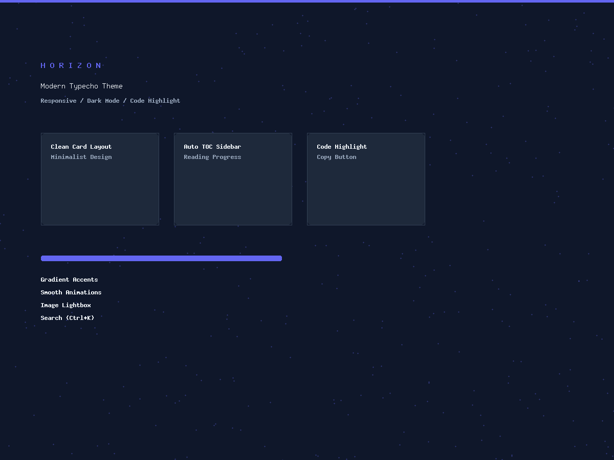

<h1 align="center">🌌 Horizon</h1>

<p align="center">
  <strong>一个为开发者打造的现代化 Typecho 博客主题</strong>
</p>

<p align="center">
  
  
  
  
</p>

<p align="center">
  
  
  
  
</p>

---

> ✨ 简洁而不简单，每一处细节都经过精心打磨。参考 Hugo PaperMod 和 Hexo Butterfly 设计风格，
> 为 Typecho 带来现代化的博客体验。

<p align="center">
  
</p>

---

## 📋 功能特性

### 🎨 核心功能

| 功能 | 说明 |
|:-----|:-----|
| 🌓 暗色/亮色模式 | 跟随系统偏好 + 手动切换，localStorage 持久化 |
| 💻 代码高亮 | Highlight.js 驱动，30+ 语言自动识别，6 种主题可选 |
| 🍎 macOS 风格代码框 | 红黄绿三色圆点 + 语言标签 + 一键复制 |
| 📂 代码框折叠 | 超长代码自动折叠，点击展开/收起 |
| 📑 文章目录 (TOC) | 自动生成，sticky 跟随滚动，高亮当前标题 |
| 📊 阅读进度条 | 顶部渐变进度条，实时显示阅读位置 |
| 🔍 搜索功能 | `Ctrl+K` 快捷键呼出，搜索结果关键词高亮 |
| 📱 响应式设计 | 完美适配桌面、平板、手机三个断点 |
| 🖼️ 图片灯箱 | 点击文章图片放大查看，ESC 关闭 |
| 🔗 面包屑导航 | 首页 > 分类 > 文章，清晰的层级关系 |
| 📌 相关文章推荐 | 文章底部自动推荐同分类内容 |
| 📝 版权声明 | CC BY-NC-SA 4.0 协议声明（可选） |

### 📄 页面模板

| 页面 | 功能 |
|:-----|:-----|
| 🏠 首页 | 文章卡片网格（2 列），支持封面图和自定义摘要 |
| 📖 文章页 | Markdown 渲染 + 面包屑 + 相关推荐 + 分享按钮 + 作者卡片 |
| 📂 分类页 | 卡片式网格展示所有分类 |
| 🏷️ 标签页 | 彩色浮动标签云动画（12 种渐变色） |
| 📚 归档页 | 按年分组的时间线，统计信息 |
| 🔎 搜索页 | 关键词高亮 + 空状态引导 |
| ❌ 404 页面 | 大号错误码 + 返回首页按钮 |

### 🚀 SEO 优化

- ✅ Open Graph + Twitter Card 元标签
- ✅ JSON-LD 结构化数据（WebSite / BlogPosting）
- ✅ 动态 `<title>` — 首页/文章/分类/标签/搜索各不同
- ✅ 语义化 HTML 标签（`<nav>` / `<article>` / `<aside>`）
- ✅ 面包屑导航（BreadcrumbList Schema）

### 💬 评论系统

- ✅ 嵌套评论支持
- ✅ Gravatar 头像
- ✅ 管理员 / 普通用户 / 访客身份区分
- ✅ 评论表单验证

### ⚙️ 后台配置项

| 图标 | 配置项 | 说明 |
|:----:|:-------|:-----|
| 🖼️ | 站点 Logo | 自定义 Logo URL |
| 🎯 | Favicon | 自定义图标 URL |
| 📑 | 文章目录 | 开启/关闭 TOC |
| 💡 | 代码高亮 | 开启/关闭 + 选择高亮主题 |
| 🎨 | 代码框风格 | 暗色/亮色切换 |
| 📊 | 字数统计 | 开启/关闭 |
| ⏱️ | 阅读时间 | 开启/关闭 |
| 👤 | 作者信息 | 开启/关闭 |
| 🔗 | 分享按钮 | 开启/关闭 |
| 🌓 | 暗色模式 | 跟随系统/亮色/暗色 |
| 📂 | 分类/标签/归档页 | 各自独立开关 |
| 🔤 | Google Fonts | 开启/关闭（提升国内访问速度） |
| 📜 | 版权声明 | 开启/关闭 |
| 🎨 | 主题色 | 自定义 HEX 颜色 |
| 🌐 | 社交链接 | GitHub / 微博 / Twitter / 邮箱 |
| 🎭 | 自定义 CSS | 自由扩展样式 |

---

## 📦 安装方法

### 1️⃣ 下载主题

```bash
git clone https://github.com/Geek0ne/horizon-theme.git
```

或直接从 [Releases](https://github.com/Geek0ne/horizon-theme/releases) 下载 ZIP 压缩包。

### 2️⃣ 上传到 Typecho

将 `Horizon` 文件夹上传到 Typecho 的 `usr/themes/` 目录：

```
typecho/
└── usr/
    └── themes/
        └── Horizon/
            ├── assets/
            │   ├── css/
            │   │   ├── style.css      # 主样式表
            │   │   └── tags.css       # 标签页样式
            │   ├── js/
            │   │   ├── main.js        # 主交互脚本
            │   │   └── tags.js        # 标签页脚本
            │   └── img/
            ├── header.php             # 头部模板
            ├── footer.php             # 页脚模板
            ├── index.php              # 首页模板
            ├── post.php               # 文章模板
            ├── page.php               # 页面模板
            ├── archive.php            # 归档模板
            ├── archives.php           # 归档页模板
            ├── search.php             # 搜索模板
            ├── categories.php         # 分类页模板
            ├── tags.php               # 标签页模板
            ├── comments.php           # 评论模板
            ├── sidebar.php            # 侧边栏模板
            ├── 404.php                # 404 页面
            ├── functions.php          # 主题配置
            ├── style.css              # 主题声明
            └── screenshot.png         # 主题预览图
```

### 3️⃣ 启用主题

1. 登录 Typecho 后台 → **控制台 → 外观**
2. 找到 **Horizon** 主题，点击 **启用**
3. 进入 **设置** 自定义主题选项

### 4️⃣ 创建导航页面

后台 → **管理 → 独立页面 → 新建**：

| 页面标题 | Slug | 模板 |
|:---------|:-----|:-----|
| 分类 | `categories` | categories |
| 标签 | `tags` | tags |
| 归档 | `archives-page` | archives |
| 友情链接 | `links` | links |

---

## 🛠️ 技术栈

| 技术 | 版本 | 说明 |
|:-----|:-----|:-----|
| Typecho | 1.3+ | 博客程序 |
| PHP | 8.0+ | 服务端语言 |
| Highlight.js | 11.9 | 代码高亮库 |
| CSS Variables | - | 双主题系统 |
| Vanilla JS | - | 零框架依赖 |

## 🌐 浏览器兼容

| 浏览器 | 版本 |
|:-------|:-----|
| Chrome / Edge | 90+ |
| Firefox | 90+ |
| Safari | 14+ |
| 移动端 Chrome / Safari | ✅ |

## 🚧 待完成 (TODO)

### 🔴 安全性

- [x] ~~搜索页 JavaScript XSS 漏洞 (`addslashes` → `json_encode`)~~
- [x] ~~面包屑导航输出未转义~~
- [x] ~~相关文章标题未转义~~
- [x] ~~coverImage/excerpt 输出未转义~~
- [x] ~~CDN 资源添加 SRI 校验 (`integrity` 属性)~~
- [x] ~~添加 Content Security Policy (CSP) 支持~~
- [x] ~~header/footer 模板未转义输出（logo/favicon/siteUrl/ogImage）~~
- [x] ~~archive.php excerpt 输出未转义~~

### 🟠 功能完整性

- [x] ~~实现 JSON-LD 结构化数据（WebSite / BlogPosting / BreadcrumbList）~~ → 已移至待定
- [x] ~~补充移动端汉堡菜单按钮 HTML 元素（CSS 已定义但缺少 HTML）~~
- [ ] 注册 `links.php` 为可用页面模板
- [x] ~~README 补充 `links` 模板使用说明~~ → 已在安装章节说明
- [x] ~~添加 LICENSE 文件（README 引用但文件缺失）~~
- [x] ~~统一许可证声明（README 声明 MIT，style.css 声明 GPL）~~

### 🟡 国际化 (i18n)

- [ ] 模板中 30+ 处硬编码中文字符串改用 `hz_t()` 函数
- [ ] JavaScript 中的字符串（复制、展开/收起代码等）通过 data 属性传递
- [ ] 语言包 `en_US.php` 完善翻译内容

### 🟢 性能优化

- [ ] `getThemeOptions()` 添加静态缓存
- [ ] JavaScript 添加 `defer` 属性
- [ ] highlight.js 添加 `defer` 或按需加载
- [x] ~~CDN 资源添加 `dns-prefetch` / `preconnect`~~
- [ ] CSS 压缩合并（当前 2514 行未压缩）
- [ ] `getRelatedPosts()` 添加缓存机制
- [ ] Google Fonts 只加载实际使用的字重

### 🔵 可访问性 (a11y)

- [ ] 添加 "跳转到内容" 链接 (skip navigation)
- [ ] 标签云动画适配 `prefers-reduced-motion`
- [ ] 装饰性 SVG 添加 `aria-hidden="true"`
- [ ] 导航链接添加 `aria-current="page"` 属性

### 🟣 浏览器兼容性

- [ ] CSS `:has()` 选择器兼容方案（Firefox < 121 不支持，影响 TOC 布局）

### ⚪ 代码质量

- [ ] 函数添加 PHPDoc 文档注释
- [ ] 添加 PHP 8.0+ 类型声明
- [ ] `themeConfig()` 按功能分组拆分
- [ ] `getReadTime()` 改为同时计算中英文
- [ ] CSS 注释语法错误修复
- [ ] 合并重复的 `@media print` 块
- [ ] `sidebar.php` 决定引入或删除
- [ ] `getRelatedPosts()` 使用 Typecho 路由生成 permalink
- [x] ~~`links.php` JSON 解析添加错误处理~~

### ⚫ 测试与文档

- [ ] 为 `functions.php` 工具函数编写 PHPUnit 单元测试
- [ ] 添加 CHANGELOG 版本变更记录
- [ ] 添加 CONTRIBUTING.md 贡献指南

---

## 📜 许可证

[MIT License](LICENSE)

## 🙏 致谢

| 项目 | 说明 |
|:-----|:-----|
| [Typecho](https://typecho.org) | 轻量级博客程序 |
| [Hugo PaperMod](https://github.com/adityatelange/hugo-PaperMod) | 设计灵感来源 |
| [Hugo Theme Stack](https://github.com/CaiJimmy/hugo-theme-stack) | 卡片布局参考 |
| [Highlight.js](https://highlightjs.org) | 代码高亮引擎 |

---

<p align="center">
  如果这个主题对你有帮助，请给个 ⭐ Star 支持一下！
</p>
